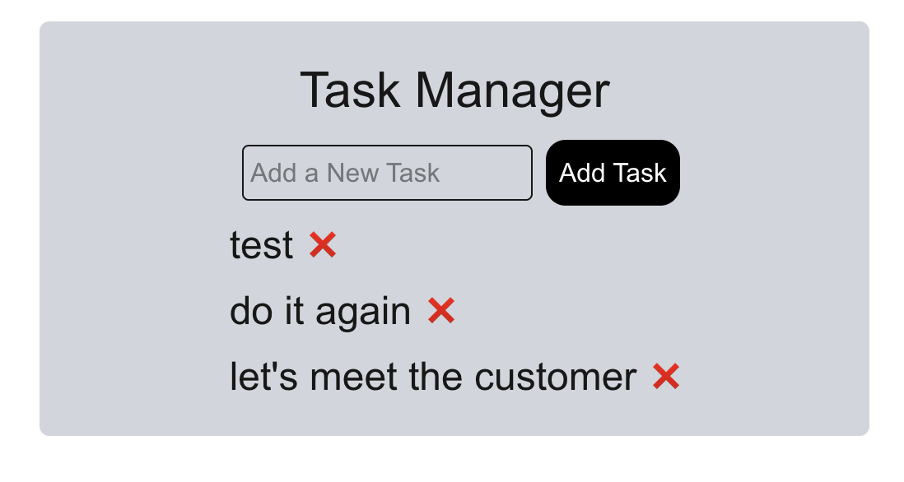

# Next.js MVC Task Manager

This is a Next.js App Router project following the MVC architecture using TypeScript.

## 🚀 Features

- **Model:** Manages task data.
- **Controller:** Handles business logic.
- **View:** Displays tasks and forms.

## 📂 Project Structure

- `models/` - Data layer
- `controllers/` - Business logic
- `components/` - UI Views

## 🛠 Installation

```sh
git clone https://github.com/your-repo/nextjs-mvc-app
cd nextjs-mvc-app
npm install
```

## To Run it in Locally in the Dev Mode and See Code Changes

```sh
npm run dev
```

Then, access the app on [http://localhost:3000](http://localhost:3000)

## To Build

```sh
npm run build
```

It will create the build artifacts under the `.next\` folder. The content of the `.next` folder should be packaged/deployed for the UI to run from a server.

## Final Output


